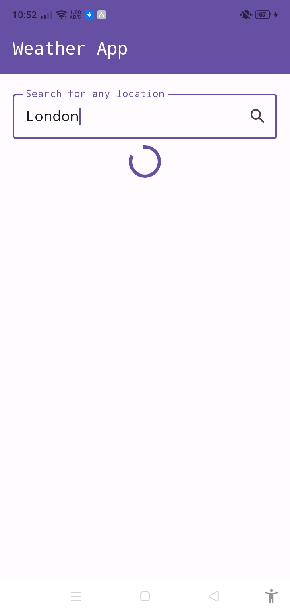
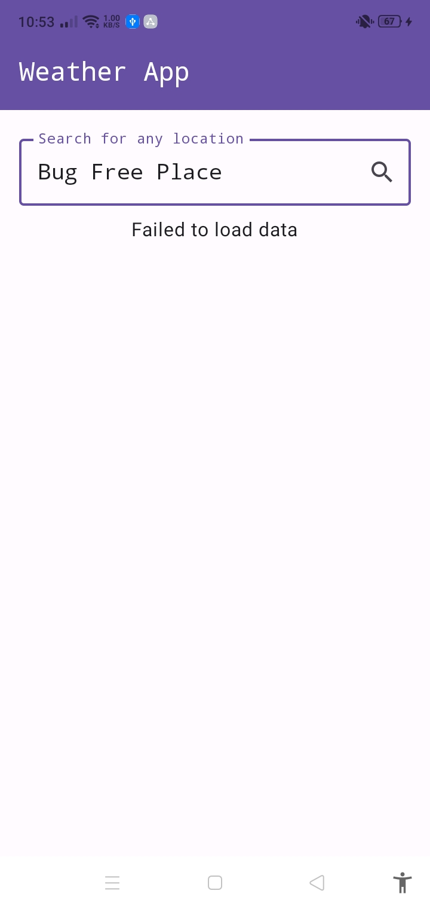
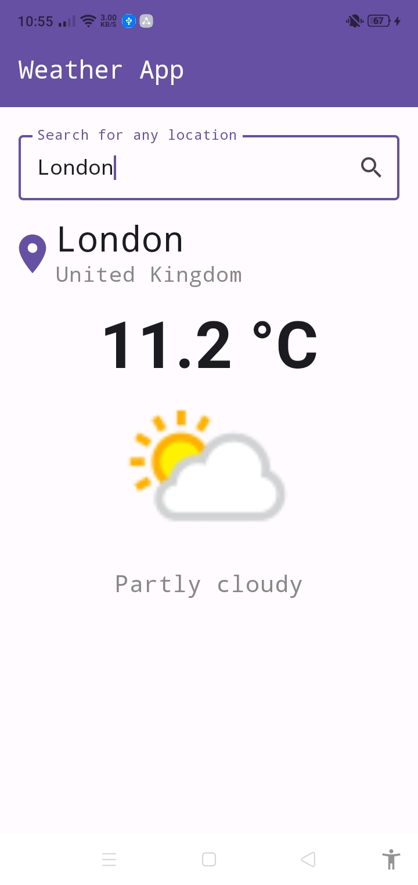
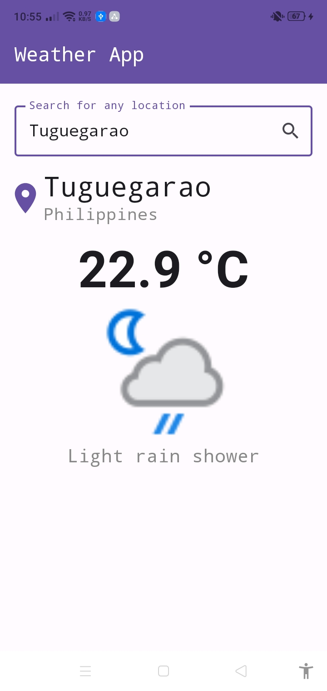

# ☀️ Weather App 🌧️

Welcome to **Weather App**! This delightful application allows you to check the weather for any location using the WeatherAPI. Built with love in **Jetpack Compose** and powered by **Retrofit**, it’s your go-to app for all things weather!

## 🌈 Features

- **Search Field**: Enter any location to retrieve the current weather.
- **Weather Display**: If the location is found, weather data will be shown; otherwise, you’ll see a friendly message indicating the failure to load data.
- **Simple UI**: A clean and intuitive interface designed with Material 3.
- **Retrofit Integration**: Learn how to make network requests seamlessly.

## ⚙️ Tech Stack

- **Jetpack Compose**: Modern toolkit for building native UI.
- **Material 3**: Beautiful design components for a sleek look.
- **Retrofit**: Powerful HTTP client for Android.

## 🌍 API

This app uses the [WeatherAPI](https://www.weatherapi.com/) to fetch weather data. You’ll need your own API key to make it work!

## 📦 Setup

1. **Clone the repository**:
   ```bash
   git clone https://github.com/ralphmarondev/weather-app.git
   ```
2. **Open the project** in Android Studio.

3. **Obtain your API key**:

   - Create an account at [WeatherAPI](https://www.weatherapi.com/).
   - Once logged in, you can find your API key right on the dashboard.

4. **Add your API key**:

   - Open the `Constants.kt` file located at `app/src/main/java/com/ralphmarondev/weatherapp/data/utils/Constants.kt`.
   - Replace `YOUR_API_KEY` with your actual API key.

5. **Run the app** on your emulator or device!

## 💖 Contributing

Contributions are welcome! If you have ideas for features or improvements, feel free to open an issue or submit a pull request. Let’s make Weather App even better together!

## 📸 Screenshots

<table>
  <tr>
    <td>
    <p>Loading data</p>
    </td>
    <td>
    <p>Failed to load data</p>
    </td>
  </tr>
  <tr>
    <td>
    <p>Testing One [SUCCESS]</p>
    
    </td>
    <td>
    <p>Testing Two [SUCCESS]</p>
    
    </td>
  </tr>
</table>

## 🙌 Acknowledgements

Big shoutout to the creators of [WeatherAPI](https://www.weatherapi.com/) for their amazing service!

## 📄 License

This project is licensed under the MIT License. See the [LICENSE](LICENSE.txt) file for details.

## 📧 Contact

If you have any questions or suggestions, feel free to reach out to me at [edaralphmaron@gmail.com](mailto:edaralphmaron@gmail.com).
